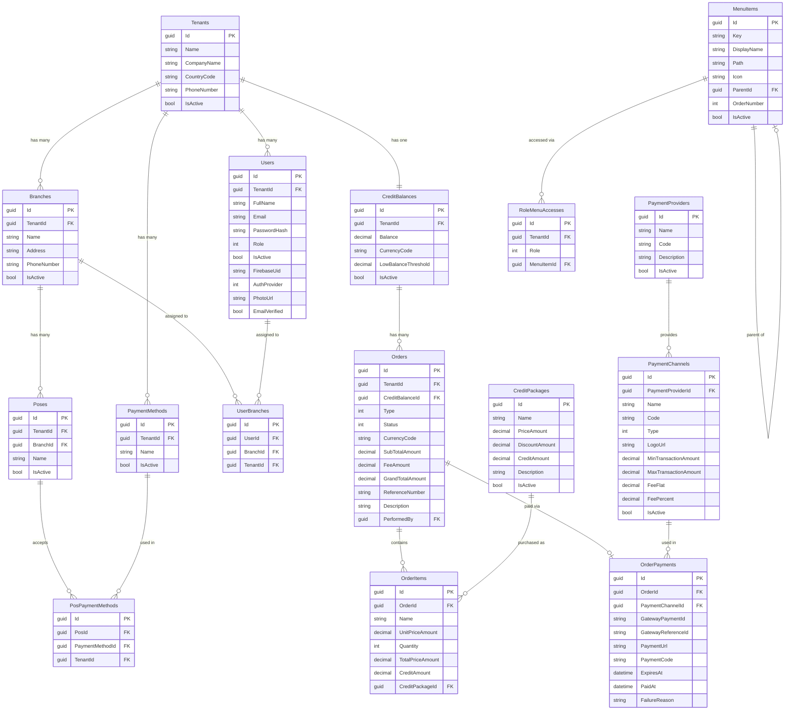

# 📊 Database Design — LaundrySaas

> Dokumen ini menjelaskan desain database saat ini berdasarkan domain entities pada project **LaundrySaas**.
> Arsitektur menggunakan **DDD (Domain-Driven Design)** dengan **multi-tenancy**, **soft-delete**, dan **audit fields** pada setiap entity.

---

## 🏗️ Arsitektur Umum

### Base Entity

Semua tabel mewarisi field berikut dari base class [Entity](file:///var/www/project/LaundrySaas/src/LaundrySaas.SharedKernel/Primitives/Entity.cs):

| Column | Type | Nullable | Keterangan |
|---|---|---|---|
| `Id` | `GUID (UUID)` | ❌ | Primary Key |
| `CreatedAt` | `DATETIME` | ❌ | Timestamp saat record dibuat (UTC) |
| `CreatedBy` | `GUID` | ✅ | User yang membuat record |
| `UpdatedAt` | `DATETIME` | ✅ | Timestamp saat record terakhir diupdate |
| `UpdatedBy` | `GUID` | ✅ | User yang mengupdate record |
| `DeletedAt` | `DATETIME` | ✅ | Timestamp soft-delete |
| `DeletedBy` | `GUID` | ✅ | User yang menghapus record |

### Multi-Tenancy

Entity yang mengimplementasikan `IMustHaveTenant` memiliki field tambahan:

| Column | Type | Nullable | Keterangan |
|---|---|---|---|
| `TenantId` | `GUID` | ❌ | Foreign key ke tabel `Tenants` |

> [!IMPORTANT]
> Semua query untuk entity multi-tenant secara otomatis difilter berdasarkan `TenantId` via **Global Query Filter** di EF Core.

### Soft Delete

Semua `DELETE` operation diubah menjadi soft-delete secara otomatis melalui `SaveChangesAsync` override — field `DeletedAt` diisi timestamp, `EntityState` diubah menjadi `Modified`.

---

## 🗂️ Bounded Context: MultiTenancy

### `Tenants` — Aggregate Root

Representasi perusahaan/organisasi laundry yang menjadi penyewa (tenant) platform.

| Column | Type | Nullable | Keterangan |
|---|---|---|---|
| `Id` | `GUID` | ❌ | PK |
| `Name` | `string` | ❌ | Nama tenant |
| `CompanyName` | `string` | ❌ | Nama perusahaan |
| `CountryCode` | `string(10)` | ✅ | Kode negara (e.g., `ID`, `MY`) |
| `PhoneNumber` | `string(30)` | ✅ | Nomor telepon |
| `IsActive` | `bool` | ❌ | Status aktif/nonaktif |
| + Audit Fields | | | Inherited dari Entity |

📄 Source: [Tenant.cs](file:///var/www/project/LaundrySaas/src/LaundrySaas.Domain/MultiTenancy/Tenant.cs)

---

### `Branches` — Entity (Multi-Tenant)

Cabang fisik milik tenant. Satu tenant bisa punya banyak branch.

| Column | Type | Nullable | Keterangan |
|---|---|---|---|
| `Id` | `GUID` | ❌ | PK |
| `TenantId` | `GUID` | ❌ | FK → `Tenants` |
| `Name` | `string` | ❌ | Nama cabang |
| `Address` | `string` | ❌ | Alamat cabang |
| `PhoneNumber` | `string` | ❌ | Nomor telepon cabang |
| `IsActive` | `bool` | ❌ | Status aktif/nonaktif |
| + Audit Fields | | | Inherited dari Entity |

**Relasi:**
- `1 Branch` → `N Pos` (via collection `PosList`)

📄 Source: [Branch.cs](file:///var/www/project/LaundrySaas/src/LaundrySaas.Domain/MultiTenancy/Branch.cs)

---

### `Poses` — Entity (Multi-Tenant)

Point of Sale (kasir/mesin) di dalam sebuah branch.

| Column | Type | Nullable | Keterangan |
|---|---|---|---|
| `Id` | `GUID` | ❌ | PK |
| `TenantId` | `GUID` | ❌ | FK → `Tenants` |
| `BranchId` | `GUID` | ❌ | FK → `Branches` |
| `Name` | `string` | ❌ | Nama POS |
| `IsActive` | `bool` | ❌ | Status aktif/nonaktif |
| + Audit Fields | | | Inherited dari Entity |

**Relasi:**
- `1 Pos` → `N PosPaymentMethod` (via collection `PaymentMethods`)

📄 Source: [Pos.cs](file:///var/www/project/LaundrySaas/src/LaundrySaas.Domain/MultiTenancy/Pos.cs)

---

### `PaymentMethods` — Entity (Multi-Tenant)

Metode pembayaran lokal milik tenant (e.g., Cash, Transfer Manual).

| Column | Type | Nullable | Keterangan |
|---|---|---|---|
| `Id` | `GUID` | ❌ | PK |
| `TenantId` | `GUID` | ❌ | FK → `Tenants` |
| `Name` | `string` | ❌ | Nama metode pembayaran |
| `IsActive` | `bool` | ❌ | Status aktif/nonaktif |
| + Audit Fields | | | Inherited dari Entity |

📄 Source: [PaymentMethod.cs](file:///var/www/project/LaundrySaas/src/LaundrySaas.Domain/MultiTenancy/PaymentMethod.cs)

---

### `PosPaymentMethods` — Join Entity (Multi-Tenant)

Tabel penghubung antara `Pos` dan `PaymentMethod` (many-to-many).

| Column | Type | Nullable | Keterangan |
|---|---|---|---|
| `Id` | `GUID` | ❌ | PK |
| `PosId` | `GUID` | ❌ | FK → `Poses` |
| `PaymentMethodId` | `GUID` | ❌ | FK → `PaymentMethods` |
| `TenantId` | `GUID` | ❌ | FK → `Tenants` |
| + Audit Fields | | | Inherited dari Entity |

📄 Source: [PosPaymentMethod.cs](file:///var/www/project/LaundrySaas/src/LaundrySaas.Domain/MultiTenancy/PosPaymentMethod.cs)

---

## 👤 Bounded Context: Users

### `Users` — Entity (Multi-Tenant)

Data pengguna platform. Mendukung login via email/password dan Google (Firebase).

| Column | Type | Nullable | Keterangan |
|---|---|---|---|
| `Id` | `GUID` | ❌ | PK |
| `TenantId` | `GUID` | ❌ | FK → `Tenants` |
| `FullName` | `string` | ❌ | Nama lengkap |
| `Email` | `string` | ❌ | Alamat email |
| `PasswordHash` | `string` | ✅ | Hash password (null untuk Google login) |
| `Role` | `enum (int)` | ❌ | Role pengguna |
| `IsActive` | `bool` | ❌ | Status aktif/nonaktif |
| `FirebaseUid` | `string` | ✅ | UID dari Firebase Authentication |
| `AuthProvider` | `enum (int)` | ❌ | Provider autentikasi |
| `PhotoUrl` | `string` | ✅ | URL foto profil |
| `EmailVerified` | `bool` | ❌ | Status verifikasi email |
| + Audit Fields | | | Inherited dari Entity |

**Computed Property:** `IsProfileComplete` → `true` jika `PasswordHash` tidak kosong.

**Relasi:**
- `1 User` → `N UserBranch` (via collection `AssignedBranches`)

**Enum `UserRole`:**
| Value | Nama |
|---|---|
| 0 | `Owner` |
| 1 | `Manager` |
| 2 | `Cashier` |
| 3 | `Accountant` |

**Enum `AuthProvider`:**
| Value | Nama | Keterangan |
|---|---|---|
| 0 | `EmailPassword` | Registrasi & login tradisional |
| 1 | `Google` | Login via Google (Firebase) |

📄 Source: [User.cs](file:///var/www/project/LaundrySaas/src/LaundrySaas.Domain/Users/User.cs)

---

### `UserBranches` — Join Entity (Multi-Tenant)

Tabel penghubung antara `User` dan `Branch`. Owner secara implisit punya akses ke semua branch.

| Column | Type | Nullable | Keterangan |
|---|---|---|---|
| `Id` | `GUID` | ❌ | PK |
| `UserId` | `GUID` | ❌ | FK → `Users` |
| `BranchId` | `GUID` | ❌ | FK → `Branches` |
| `TenantId` | `GUID` | ❌ | FK → `Tenants` |
| + Audit Fields | | | Inherited dari Entity |

📄 Source: [UserBranch.cs](file:///var/www/project/LaundrySaas/src/LaundrySaas.Domain/Users/UserBranch.cs)

---

### `MenuItems` — Entity (Global)

Master data menu navigasi. **Tidak** menggunakan multi-tenant filter — berlaku global.

| Column | Type | Nullable | Keterangan |
|---|---|---|---|
| `Id` | `GUID` | ❌ | PK |
| `Key` | `string` | ❌ | Unique key identifier |
| `DisplayName` | `string` | ❌ | Nama tampilan menu |
| `Path` | `string` | ❌ | Route/URL path |
| `Icon` | `string` | ❌ | Nama ikon |
| `ParentId` | `GUID` | ✅ | FK → `MenuItems` (self-referencing, untuk submenu) |
| `OrderNumber` | `int` | ❌ | Urutan tampilan |
| `IsActive` | `bool` | ❌ | Status aktif/nonaktif |
| + Audit Fields | | | Inherited dari Entity |

📄 Source: [MenuItem.cs](file:///var/www/project/LaundrySaas/src/LaundrySaas.Domain/Users/MenuItem.cs)

---

### `RoleMenuAccesses` — Entity (Multi-Tenant)

Mapping role ke menu yang boleh diakses, per tenant.

| Column | Type | Nullable | Keterangan |
|---|---|---|---|
| `Id` | `GUID` | ❌ | PK |
| `TenantId` | `GUID` | ❌ | FK → `Tenants` |
| `Role` | `enum (int)` | ❌ | `UserRole` (Owner/Manager/dll) |
| `MenuItemId` | `GUID` | ❌ | FK → `MenuItems` |
| + Audit Fields | | | Inherited dari Entity |

📄 Source: [RoleMenuAccess.cs](file:///var/www/project/LaundrySaas/src/LaundrySaas.Domain/Users/RoleMenuAccess.cs)

---

## 💳 Bounded Context: Billing

### `CreditBalances` — Aggregate Root (Multi-Tenant)

Saldo kredit tenant. Setiap tenant memiliki tepat satu `CreditBalance`. Semua mutasi saldo melewati aggregate ini.

| Column | Type | Nullable | Keterangan |
|---|---|---|---|
| `Id` | `GUID` | ❌ | PK |
| `TenantId` | `GUID` | ❌ | FK → `Tenants` (unique per tenant) |
| `Balance` | `decimal` | ❌ | Saldo kredit saat ini |
| `CurrencyCode` | `string` | ❌ | Kode mata uang (default: `IDR`) |
| `LowBalanceThreshold` | `decimal` | ❌ | Ambang batas saldo rendah |
| `IsActive` | `bool` | ❌ | Status aktif/nonaktif |
| + Audit Fields | | | Inherited dari Entity |

**Relasi:**
- `1 CreditBalance` → `N Order` (via collection `Orders`)

**Domain Events:**
- `CreditToppedUpEvent` — saat saldo ditambah (top-up / refund)
- `CreditDeductedEvent` — saat saldo dikurangi
- `LowCreditBalanceEvent` — saat saldo di bawah threshold

📄 Source: [CreditBalance.cs](file:///var/www/project/LaundrySaas/src/LaundrySaas.Domain/Billing/CreditBalance.cs)

---

### `Orders` — Entity (Multi-Tenant)

Representasi transaksi billing (top-up, deduction, refund, adjustment).

| Column | Type | Nullable | Keterangan |
|---|---|---|---|
| `Id` | `GUID` | ❌ | PK |
| `TenantId` | `GUID` | ❌ | FK → `Tenants` |
| `CreditBalanceId` | `GUID` | ❌ | FK → `CreditBalances` |
| `Type` | `enum (int)` | ❌ | Tipe order |
| `Status` | `enum (int)` | ❌ | Status order |
| `CurrencyCode` | `string` | ❌ | Kode mata uang |
| `SubTotalAmount` | `decimal(18,2)` | ❌ | Subtotal (owned: `Money`) |
| `SubTotalCurrency` | `string(3)` | ❌ | Currency subtotal |
| `FeeAmount` | `decimal(18,2)` | ❌ | Biaya tambahan (owned: `Money`) |
| `FeeCurrency` | `string(3)` | ❌ | Currency fee |
| `GrandTotalAmount` | `decimal(18,2)` | ❌ | Grand total (owned: `Money`) |
| `GrandTotalCurrency` | `string(3)` | ❌ | Currency grand total |
| `ReferenceNumber` | `string` | ❌ | Nomor referensi unik |
| `Description` | `string` | ❌ | Deskripsi transaksi |
| `PerformedBy` | `GUID` | ✅ | FK → `Users` (user yang melakukan) |
| + Audit Fields | | | Inherited dari Entity |

**Relasi:**
- `1 Order` → `N OrderItem` (via collection `Items`)
- `1 Order` → `0..1 OrderPayment` (one-to-one, via `Payment`)

**Enum `OrderType`:**
| Value | Nama | Keterangan |
|---|---|---|
| 0 | `TopUp` | Pengisian saldo kredit |
| 1 | `UsageFee` | Pemotongan per penggunaan fitur |
| 2 | `Subscription` | Pemotongan langganan berkala |
| 3 | `Refund` | Pengembalian saldo |
| 4 | `Adjustment` | Penyesuaian manual oleh admin |

**Enum `OrderStatus`:**
| Value | Nama | Keterangan |
|---|---|---|
| 0 | `Pending` | Menunggu pembayaran |
| 1 | `Processing` | Diproses oleh payment gateway |
| 2 | `Succeeded` | Berhasil |
| 3 | `Failed` | Gagal |
| 4 | `Expired` | Kadaluarsa |
| 5 | `Cancelled` | Dibatalkan |

📄 Source: [Order.cs](file:///var/www/project/LaundrySaas/src/LaundrySaas.Domain/Billing/Order.cs)

---

### `OrderItems` — Entity

Detail item di dalam sebuah Order.

| Column | Type | Nullable | Keterangan |
|---|---|---|---|
| `Id` | `GUID` | ❌ | PK |
| `OrderId` | `GUID` | ❌ | FK → `Orders` |
| `Name` | `string` | ❌ | Nama item |
| `UnitPriceAmount` | `decimal(18,2)` | ❌ | Harga satuan (owned: `Money`) |
| `UnitPriceCurrency` | `string(3)` | ❌ | Currency harga satuan |
| `Quantity` | `int` | ❌ | Jumlah |
| `TotalPriceAmount` | `decimal(18,2)` | ❌ | Total harga (owned: `Money`) |
| `TotalPriceCurrency` | `string(3)` | ❌ | Currency total harga |
| `CreditAmount` | `decimal` | ❌ | Jumlah kredit yang didapat/dipotong |
| `CreditPackageId` | `GUID` | ✅ | FK → `CreditPackages` (opsional) |
| + Audit Fields | | | Inherited dari Entity |

**Relasi:**
- `N OrderItem` → `0..1 CreditPackage` (FK opsional, `ON DELETE RESTRICT`)

📄 Source: [OrderItem.cs](file:///var/www/project/LaundrySaas/src/LaundrySaas.Domain/Billing/OrderItem.cs)

---

### `OrderPayments` — Entity

Detail pembayaran untuk sebuah Order (integrasi payment gateway).

| Column | Type | Nullable | Keterangan |
|---|---|---|---|
| `Id` | `GUID` | ❌ | PK |
| `OrderId` | `GUID` | ❌ | FK → `Orders` (one-to-one, `ON DELETE CASCADE`) |
| `PaymentChannelId` | `GUID` | ❌ | FK → `PaymentChannels` (`ON DELETE RESTRICT`) |
| `GatewayPaymentId` | `string` | ✅ | ID pembayaran dari payment gateway |
| `GatewayReferenceId` | `string` | ✅ | Reference ID internal (`PAY-{id}`) |
| `PaymentUrl` | `string` | ✅ | URL halaman pembayaran |
| `PaymentCode` | `string` | ✅ | Kode pembayaran (VA number, dsb) |
| `ExpiresAt` | `DATETIME` | ✅ | Waktu kadaluarsa pembayaran |
| `PaidAt` | `DATETIME` | ✅ | Waktu pembayaran berhasil |
| `FailureReason` | `string` | ✅ | Alasan kegagalan |
| + Audit Fields | | | Inherited dari Entity |

📄 Source: [OrderPayment.cs](file:///var/www/project/LaundrySaas/src/LaundrySaas.Domain/Billing/OrderPayment.cs)

---

### `PaymentProviders` — Entity (Global)

Master data payment gateway provider (e.g., Xendit, Midtrans, Doku).

| Column | Type | Nullable | Keterangan |
|---|---|---|---|
| `Id` | `GUID` | ❌ | PK |
| `Name` | `string` | ❌ | Nama provider |
| `Code` | `string` | ❌ | Kode unik (uppercase) |
| `Description` | `string` | ✅ | Deskripsi |
| `IsActive` | `bool` | ❌ | Status aktif/nonaktif |
| + Audit Fields | | | Inherited dari Entity |

**Relasi:**
- `1 PaymentProvider` → `N PaymentChannel` (via collection `Channels`, `ON DELETE CASCADE`)

📄 Source: [PaymentProvider.cs](file:///var/www/project/LaundrySaas/src/LaundrySaas.Domain/Billing/PaymentProvider.cs)

---

### `PaymentChannels` — Entity (Global)

Channel spesifik di dalam sebuah provider (e.g., BCA Virtual Account, OVO).

| Column | Type | Nullable | Keterangan |
|---|---|---|---|
| `Id` | `GUID` | ❌ | PK |
| `PaymentProviderId` | `GUID` | ❌ | FK → `PaymentProviders` |
| `Name` | `string` | ❌ | Nama channel |
| `Code` | `string` | ❌ | Kode unik (uppercase) |
| `Type` | `enum (int)` | ❌ | Tipe payment method |
| `LogoUrl` | `string` | ✅ | URL logo |
| `MinTransactionAmount` | `decimal` | ✅ | Minimum transaksi |
| `MaxTransactionAmount` | `decimal` | ✅ | Maximum transaksi |
| `FeeFlat` | `decimal` | ✅ | Biaya flat per transaksi |
| `FeePercent` | `decimal` | ✅ | Biaya persentase per transaksi |
| `IsActive` | `bool` | ❌ | Status aktif/nonaktif |
| + Audit Fields | | | Inherited dari Entity |

**Enum `PaymentMethodType`:**
| Value | Nama | Keterangan |
|---|---|---|
| 0 | `VirtualAccount` | Transfer bank via VA |
| 1 | `EWallet` | Digital wallet (OVO, DANA, GoPay, dsb) |
| 2 | `QrCode` | QRIS / QR payment |
| 3 | `RetailOutlet` | Pembayaran di minimarket |
| 4 | `BankTransfer` | Transfer bank langsung |
| 5 | `CreditCard` | Kartu kredit |

📄 Source: [PaymentChannel.cs](file:///var/www/project/LaundrySaas/src/LaundrySaas.Domain/Billing/PaymentChannel.cs)

---

### `CreditPackages` — Entity (Global)

Master data paket kredit yang bisa dibeli tenant.

| Column | Type | Nullable | Keterangan |
|---|---|---|---|
| `Id` | `GUID` | ❌ | PK |
| `Name` | `string` | ❌ | Nama paket |
| `PriceAmount` | `decimal(18,2)` | ❌ | Harga normal (owned: `Money`) |
| `PriceCurrency` | `string(3)` | ❌ | Currency harga normal |
| `DiscountAmount` | `decimal(18,2)` | ✅ | Harga diskon (owned: `Money`) |
| `DiscountCurrency` | `string(3)` | ✅ | Currency harga diskon |
| `CreditAmount` | `decimal` | ❌ | Jumlah kredit yang didapat |
| `Description` | `string` | ✅ | Deskripsi paket |
| `IsActive` | `bool` | ❌ | Status aktif/nonaktif |
| + Audit Fields | | | Inherited dari Entity |

**Computed Property:** `ActivePrice` → menggunakan `DiscountPrice` jika tersedia, fallback ke `Price`.

📄 Source: [CreditPackage.cs](file:///var/www/project/LaundrySaas/src/LaundrySaas.Domain/Billing/CreditPackage.cs)

---

### `Money` — Value Object

Object value yang merepresentasikan mata uang. **Tidak** disimpan sebagai tabel terpisah, melainkan di-embed (owned type) ke dalam tabel parent.

| Property | Type | Keterangan |
|---|---|---|
| `Amount` | `decimal` | Nominal uang |
| `CurrencyCode` | `string` | Kode mata uang (uppercase, e.g., `IDR`) |

📄 Source: [Money.cs](file:///var/www/project/LaundrySaas/src/LaundrySaas.Domain/Billing/Money.cs)

---

## 🔗 Entity Relationship Diagram

---

## 📋 Ringkasan Tabel

| # | Tabel | Bounded Context | Tipe | Multi-Tenant | Aggregate Root |
|---|---|---|---|---|---|
| 1 | `Tenants` | MultiTenancy | Entity | ❌ (Root) | ✅ |
| 2 | `Branches` | MultiTenancy | Entity | ✅ | ❌ |
| 3 | `Poses` | MultiTenancy | Entity | ✅ | ❌ |
| 4 | `PaymentMethods` | MultiTenancy | Entity | ✅ | ❌ |
| 5 | `PosPaymentMethods` | MultiTenancy | Join Entity | ✅ | ❌ |
| 6 | `Users` | Users | Entity | ✅ | ❌ |
| 7 | `UserBranches` | Users | Join Entity | ✅ | ❌ |
| 8 | `MenuItems` | Users | Entity | ❌ (Global) | ❌ |
| 9 | `RoleMenuAccesses` | Users | Entity | ✅ | ❌ |
| 10 | `CreditBalances` | Billing | Entity | ✅ | ✅ |
| 11 | `Orders` | Billing | Entity | ✅ | ❌ |
| 12 | `OrderItems` | Billing | Entity | ❌ | ❌ |
| 13 | `OrderPayments` | Billing | Entity | ❌ | ❌ |
| 14 | `PaymentProviders` | Billing | Entity | ❌ (Global) | ❌ |
| 15 | `PaymentChannels` | Billing | Entity | ❌ (Global) | ❌ |
| 16 | `CreditPackages` | Billing | Entity | ❌ (Global) | ❌ |

> **Total: 16 tabel** — 9 tabel multi-tenant, 7 tabel global/master data.

---

## ⚙️ Konfigurasi EF Core

📄 Source: [ApplicationDbContext.cs](file:///var/www/project/LaundrySaas/src/LaundrySaas.Infrastructure/Data/ApplicationDbContext.cs)

### Owned Types (Value Objects sebagai kolom)
- `Order.SubTotal`, `Order.FeeAmount`, `Order.GrandTotal` → `Money` (Amount + CurrencyCode)
- `OrderItem.UnitPrice`, `OrderItem.TotalPrice` → `Money`
- `CreditPackage.Price`, `CreditPackage.DiscountPrice` → `Money`

### Delete Behavior
| Relasi | ON DELETE |
|---|---|
| `Order` → `OrderPayment` | `CASCADE` |
| `PaymentProvider` → `PaymentChannel` | `CASCADE` |
| `OrderItem` → `CreditPackage` | `RESTRICT` |
| `OrderPayment` → `PaymentChannel` | `RESTRICT` |

### Global Query Filters
Diterapkan pada semua entity yang mengimplementasikan `IMustHaveTenant`:
`Branches`, `Poses`, `PaymentMethods`, `PosPaymentMethods`, `Users`, `UserBranches`, `RoleMenuAccesses`, `CreditBalances`, `Orders`
